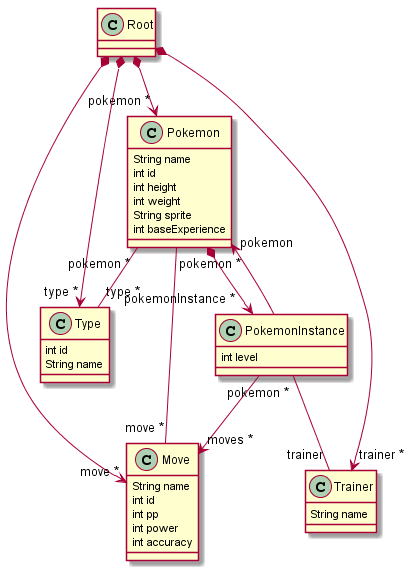

# pokeMDD

This application fetches data from the REST API pokeapi.co and imports the data into an Ecore model for the first generation pokémons. This data can then be viewed and edited with Sirius to add trainers and pokémon instances and assign pokémon instances to trainers. The application focuses on proof of concept. Because of this the Sirius diagram shows a variety of nodes and containers, instead of trying to be pretty. Included is an example .xmi file with imported pokémons, two trainers and assigned pokémon instances.

## Prerequisites

Install the folowing into Eclipse:
* Acceleo
* Acceleo Query SDK
* Sirius Properties Views - Runtime Support
* Sirius Properties Views - Specifier Support
* Sirius Specifier Environment
* (Ecore Diagram Editor (SDK))
* (Lots and lots of ram)

## Running the diagram

1. Clone the Git repository
2. Import the projects into Eclipse
    * Set _pokemon.model_ and _my.project.design_ as active plugins
3. Launch a new runtime from your Eclipse
    * Click on **Run / Run Configurations**
    * Double click on **Eclipse Application** to get a New_configuration
    * Add **-XX:MaxPermSize=256m** option in your VM arguments
4. Open poke.examples > representations.aird > pokemonViewpoint > Pokemon diagram > new Pokemon diagram

## Documentation

### The Ecore Model

Pokémon is the class used for data common for instances of a specific Pokémon, e.g. every Pikachu has the same ID, the same weight, and the same height. Pokemon have pointers to its corresponding types and moves.

PokemonInstance holds the information about one instance of a pokemon, e.g. what 4 moves it has, its level, and who owns that specific pokemon. These are contained by the Pokemon class.

Trainers can own PokemonInstances. 

Root is the container for Pokemon, Move, Type, and Trainer.

The model has constraints for ensuring valid model instances, like positive numbers for height and not duplicating moves of pokémons.

### The Diagram

**Containers:**

**Pokemon:** Contain all the Pokemon, each with an  image, a lists of their moves and types, as well as id, height, and weight.

**Trainer:** Contains the Trainers, which in turn contain all their Pokémon. 

**Nodes:**

Pokemon, PokemonInstance, Move, Type

**Edges:**

* Pokemon to its Instance
* Pokemon to its Moves
* Pokemon to its Types
* Trainer to its PokemonInstances

### Fetching Data

Data is fetched from https://pokeapi.co/api/v2/.

To fetch data run PokemonSerialize.java in poke.model > src > pokemon.main.

This will create a new file called root.pokemon in poke.model > model

Move this file to the poke.examples project and rename it to root.xmi.

You can now create a new pokemon diagram based on this file.
